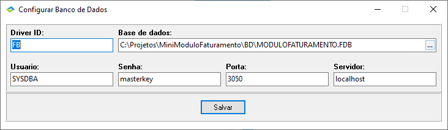
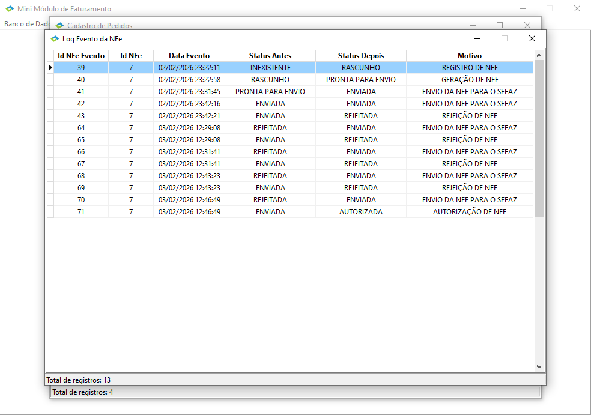

<h1 align="center">    
    
Decisões tomadas ao longo do desenvolvimento

</h1>

- **Banco de Dados/Configurar...**: Criação de uma tela básica para configurar os parâmetros de conexão do arquivo de banco de dados, facilitando esse tipo de configuração.

  

 

- **Botão Log NFe**: Botão de visualização do log da NFe, onde é possível ver o ciclo de vida de uma NFe acontecendo. A ideia aqui é acompanhar o status atual de cada fase do ciclo de uma NFe, tendo o raciocínio da seguinte maneira: No primeiro momento que é criado um Pedido, onde se seleciona o cliente que foi previamente cadastrado e depois os produtos que esse cliente tem intenção de comprar, o status do Pedido é criado como Pendente e é criado uma entrada na tabela NFE configurando o campo **STATUS_ATUAL** como **RASCUNHO**. Nesse momento o botão Gerar NFe fica disponível e a ideia aqui é que NFe só seja gerada com a confirmação do pagamento do pedido solicitado. Uma vez que sinalizado, basta clicar no botão Gerar NFe para que o sistema gere o XML da Nota Fiscal. Assim que  XML é gerado o status do pedido passa a ser **Confirmado** e o status da NFe passa para **PRONTA PARA ENVIO**, o botão Enviar NFe é liberado, para que se possa enviar a Nota Fiscal para o SEFAZ. O simulador do Sefaz, na classe TSefaz, valida as informações enviadas no que tange a cadastro de cliente e cadastro de produto, e dependendo do que ocorrer um status é devolvido para o chamador. Se for status **REJEITADA** por haver encontrado algum tipo de problema no cadastro, então o status do pedido continua sendo **Confirmado** e o status da NFe passa para **REJEITADA**, já que é permitido o reenvio da NFe após a correção dos problemas apontados. Caso dê tudo certo, o status de retorno é **AUTORIZADA**, passando o status do pedido para **Faturado** e o status da NFe para **AUTORIZADA**. Ao clicar no botão, podemos ver esse ciclo da NFe, que fica registrado na tabela **NFE_EVENTO**. Lembrando que, cada registro lançado nessa tabela, é registrado o status anterior em que a NFe estava e o novo status em que ela se encontra.

- **Classe Sefaz**: Idealizada a criação de uma classe chamada Sefaz para simular o retorno do SEFAZ como solicitado no teste. Nessa classe foram validados todos os pontos possíveis com relação ao cadastro de clientes e produtos. Retornando para o chamador o status **REJEITADA** caso a validação falhe em algum ponto.

- **Criação do campo VL_TOTAL da tabela PEDIDO_ITEM**: Necessário para pode armazenar o cálculo dos campos **QUANTIDADE** x **VL_UNITARIO**, dispensando a necessidade de criar campo calculado. Servindo também para checagem do campo **TOTAL** da tabela **PEDIDO**.

- **Criação do campo CORRIGIR da tabela NFE**: Tomada a decisão de criar um campo a mais na tabela NFE para sinalizar com **S** caso o status de retorno da classe **Sefaz** seja **REJEITADA**. Essa flag ajuda a identificar um pedido que esteja com **Pendência de Correção** e ao realizar as devidas correções no que tange a cadastro de clientes e produtos, o documento XML da NFe é gerado novamente, antes de ser enviado para a classe **Sefaz**.

- **Menu Sefaz**: Opção de menu criada para conter dois itens: **Receber NFe** e **Contingência**. 
  - **Receber NFe**: Uma rápida opção para simular o retorno do SEFAZ de uma NFe específica. 
  - **Contingência**: Opção para simular a indisponibilidade do sistema do SEFAZ. **Marcado**, o status da NFe passará a ser de **CONTINGENCIA**. **Desmarcado**, seguirá o fluxo normal.