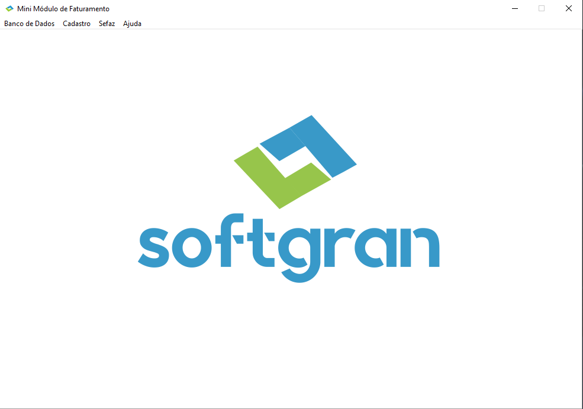
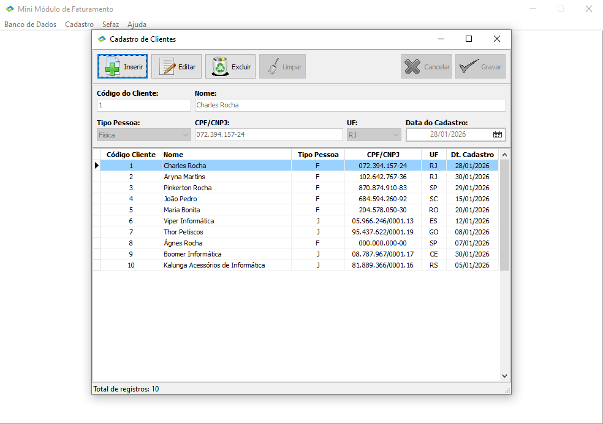
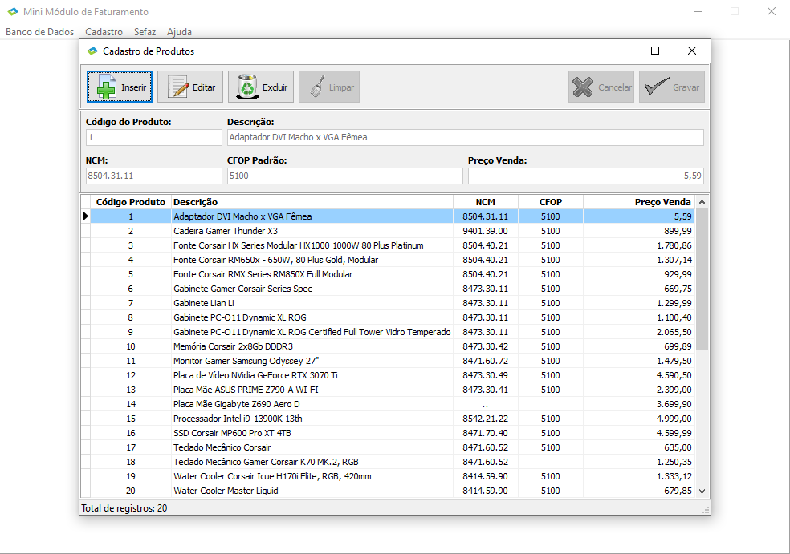
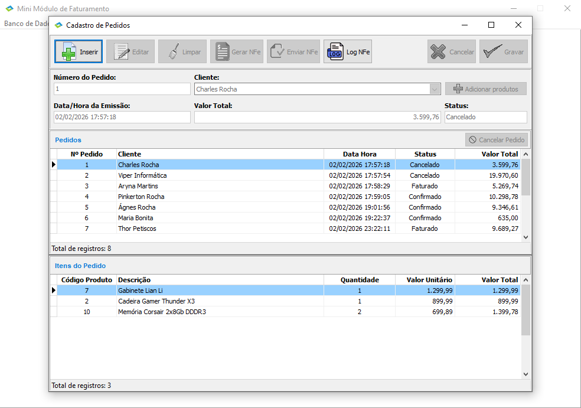
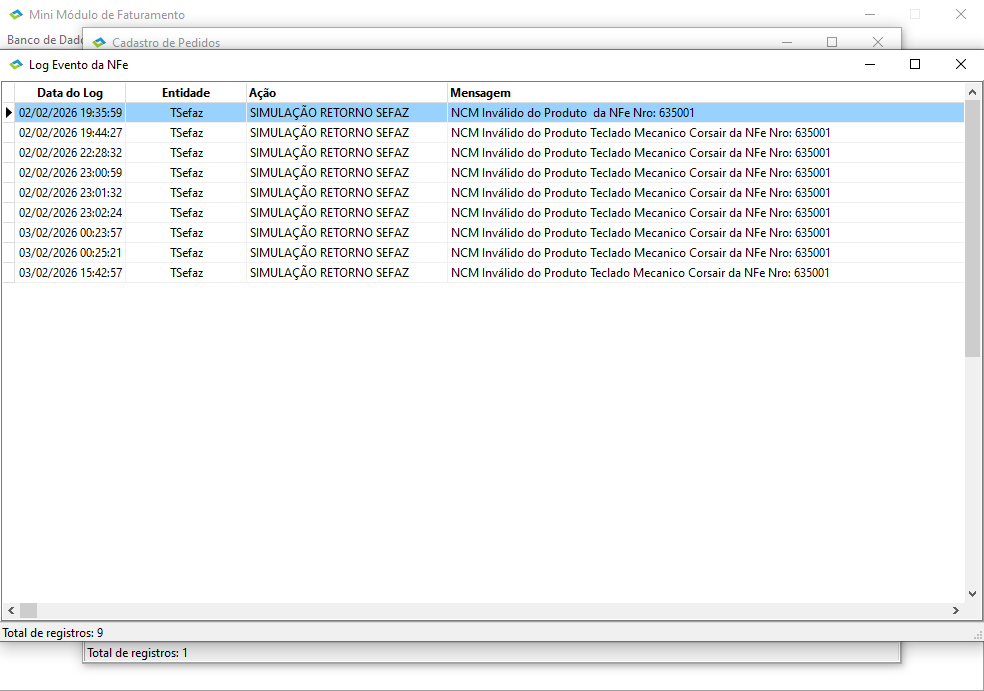

<h1 align="center">    
    
Projeto Mini Módulo Faturamento

        
	      
    		
	  
    
	      
    
	      
    
	      
    
</h1>

## Índice
- [Sobre](#-sobre)
- [Feramentas](#-ferramentas)
- [Funcionalidades](#-funcionalidades)
- [Licença](#-licença)

## 📘 Sobre

**Teste técnico para Analista Desenvolvedor Delphi**, sistema para Simulação de Processo de Faturamento em ERP.

**Tempo total de desenvolvimento do projeto:** 40 horas.

## 🛠 Ferramentas

- [Delphi 12](https://www.embarcadero.com/br/)
- [Firebird](https://www.firebirdsql.org/)
- [FireDAC](https://www.embarcadero.com/br/products/rad-studio/firedac)
- [ACBr](https://projetoacbr.com.br/)
- [Git](https://git-scm.com/)
- [Tortoise Git](https://tortoisegit.org/)

## 💡 Funcionalidades

- **Banco de Dados/Configurar...**: Abre a tela de configuração do arquivo **modulo_faturamento.ini**. Esse arquivo deve ficar na pasta **Config** na raíz do programa.
  - **OBS.:** Antes de realizar qualquer ação no programa, certifique-se de que o campo **Base de Dados** esteja apontando para o seu arquivo de banco de dados.

- **Cadastro**: Tela para cadastro de **Clientes**, **Produtos** e **Pedidos**.
  - **Cadastro de Clientes**: Tela para cadastro dos **clientes** que será necessário para realizar um **pedido**.
  - **Cadastro de Produtos**: Tela para cadastro dos **produtos** que será necessário para realizar um **pedido**.
  - **Cadastro de Pedidos**: Tela para cadastro dos **pedidos** onde é possível selecionar os **clientes** e **produtos** para a realização de um **pedido**.
    - **Gerar NFe**: Botão para geração da NFe, que fica disponível assim que o pedido é salvo no banco de dados.
    - **Enviar NFe**: Botão para envio da NFe para simulação do SEFAZ, que fica disponível assim que a geração da NFe é realizada.
	- **Log NFe**: Botão para visualização do log da NFe, onde é possível ver o ciclo de vida de uma NFe acontecendo.
	- **Cancelar Pedido**: Botão para cancelamento do pedido, que fica disponível somente quando o status da NFe passa para **AUTORIZADA**.
	- **Rótulo Pendente de Correção**: Rótulo de alerta para informar que o pedido tem correções a serem feitas em cadastro de clientes ou produtos. Para mais detalhes, clicar em **Visualizar Log**.
	- **Visualizar Log**: Botão para visualizar o log quando uma NFe é enviada para o SEFAZ. Esse botão só aparece quando uma NFe recebe o status de retorno **REJEITADA**.
	
- **Sefaz**: Menu contendo duas funções: **Receber NFe** e **Contingência**
  - **Receber NFe**: Uma rápida opção para simular o retorno do SEFAZ de uma NFe específica.
  - **Contingência**: Opção para simular a indisponibilidade do sistema do SEFAZ. **Marcado**, o status da NFe passará a ser de **CONTINGENCIA**. **Desmarcado**, seguirá o fluxo normal.

## 📄 Licença

Esse software é **free** e foi construído para realizar o **Teste técnico para Analista Desenvolvedor Delphi**.
